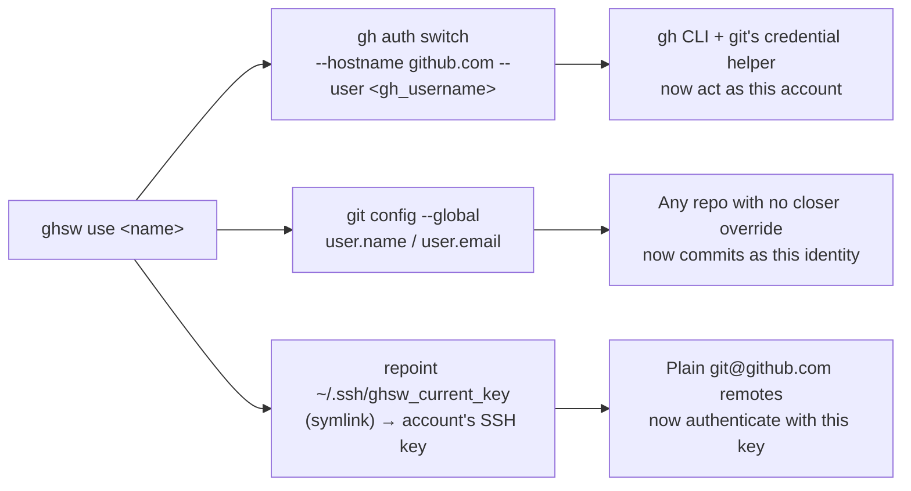
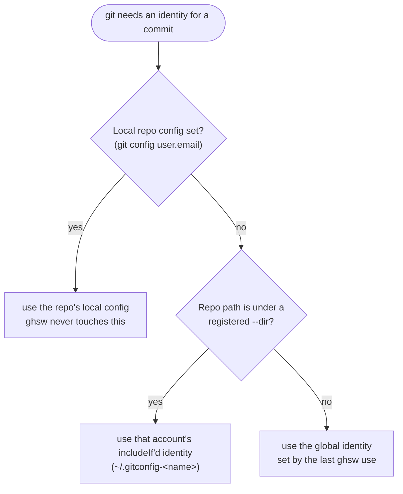
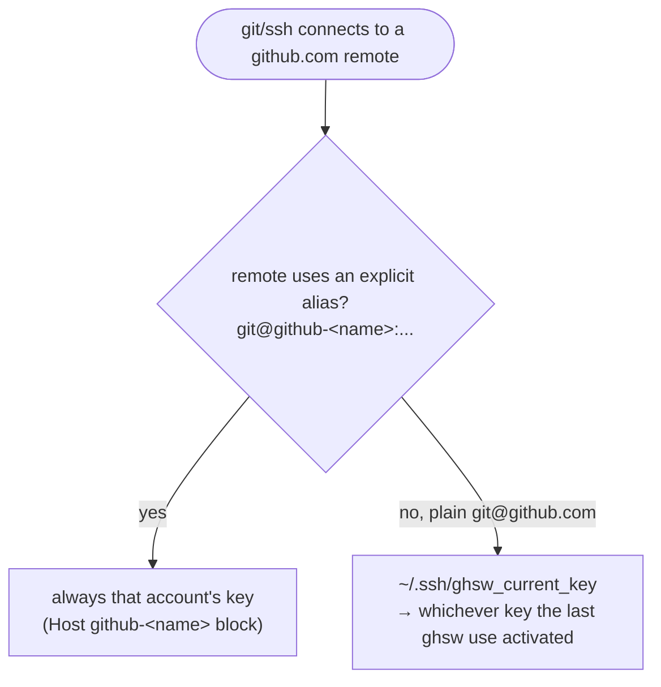
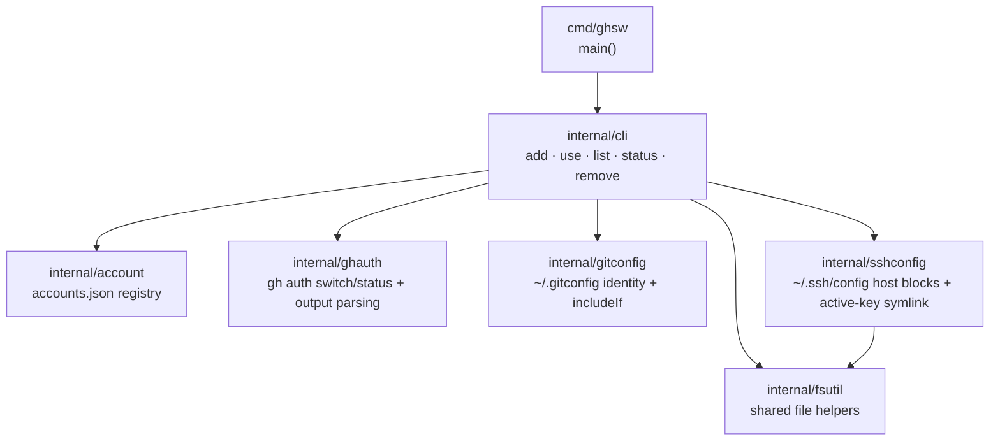

# ghsw — GitHub Switch

Switch between multiple GitHub identities (work, personal, client, ...) on one machine with a single command.

## What this actually is

`ghsw` does **not** reimplement GitHub authentication. There is no OAuth flow, no credential storage, and no network code in this tool at all. It's a thin orchestrator over mechanisms that already exist and already work:

- **the `gh` CLI's native `gh auth switch`** — so the `gh` tool and `git`'s credential helper both point at the right account.
- **git's global `user.name`/`user.email`** (`~/.gitconfig`) — set on every `ghsw use`, so any repo without a more specific override picks up the right identity.
- **an SSH key symlink indirection** — `ghsw` manages a `Host github.com` block in `~/.ssh/config` whose `IdentityFile` points at a stable symlink (`~/.ssh/ghsw_current_key`); `ghsw use` repoints that symlink, so plain `git@github.com:...` remotes use the right key everywhere, with no special remote URL needed.
- **git's `includeIf "gitdir:...”` conditional includes** (optional, via `--dir`) — pins a folder to one identity regardless of which account is active machine-wide, for people who keep strict work/personal folder separation.
- **SSH config host aliases** (`Host github-<name>`) — an explicit, always-available override: `git@github-work:...` always uses work's key, no matter what's currently active.

`ghsw add` registers an identity and wires up the directory-scoped/explicit-alias overrides; `ghsw use` flips the **machine-wide default** — `gh` account, global git identity, and default SSH key — in one command; `ghsw list`/`ghsw status` tell you what's configured and what's currently active.



### How identity resolves, in order

**Git identity** (`user.name`/`user.email`) for a commit:



**SSH key** for a `github.com` connection:



In short: **local repo config beats `--dir` scoping beats the machine-wide default** for identity, and **an explicit alias beats the machine-wide default** for SSH keys.

## What it doesn't do

- It does not run `gh auth login` for you. Authenticating a new identity is an interactive OAuth flow that `gh` already handles well — `ghsw add` tells you the exact command to run if needed.
- It does not manage SSH keys — you generate and register keys yourself; `ghsw` just points `~/.ssh/config` at the path you give it.
- It does not touch any repository's `.git/config` — everything it writes is global (`~/.ssh/config`, `~/.gitconfig`, `~/.gitconfig-<name>`, `~/.ghsw/accounts.json`).
- It is not a credential store or a secrets manager.
- It won't untangle a `Host github.com` block you already wrote by hand in `~/.ssh/config` — SSH uses the first value it finds per setting, so a pre-existing block can shadow the one `ghsw` manages. `ghsw use` detects this and prints a warning with exactly what to fix, rather than silently reordering your config.
- Symlinking the active key requires OS support; on Windows without Developer Mode, where unprivileged symlinks aren't allowed, `ghsw` falls back to copying the key file into place instead.

## Example

```console
$ ghsw add work \
    --key ~/.ssh/id_ed25519_work \
    --dir ~/code/work \
    --name "Ada Lovelace" \
    --email ada@work-co.com \
    --gh-user ada-work

added SSH host alias "github-work" to /home/ada/.ssh/config
wrote git identity file /home/ada/.gitconfig-work
added includeIf block for /home/ada/code/work to /home/ada/.gitconfig

registered account "work"
this tool does not run `gh auth login` for you — if this identity
isn't authenticated yet, run:
  gh auth login --hostname github.com
then switch to it machine-wide any time with:
  ghsw use work

$ ghsw add personal \
    --key ~/.ssh/id_ed25519_personal \
    --name "Ada Lovelace" \
    --email ada@lovelace.dev \
    --gh-user adalovelace

added SSH host alias "github-personal" to /home/ada/.ssh/config

registered account "personal"
this tool does not run `gh auth login` for you — if this identity
isn't authenticated yet, run:
  gh auth login --hostname github.com
then switch to it machine-wide any time with:
  ghsw use personal

$ ghsw use personal
gh: active account is now adalovelace
git: global user.name/user.email set to "Ada Lovelace" <ada@lovelace.dev>
added a managed "Host github.com" block to /home/ada/.ssh/config
ssh: git@github.com now uses /home/ada/.ssh/id_ed25519_personal

switched to "personal" (adalovelace) machine-wide

$ ghsw list
NAME      GH USER      GIT EMAIL             GIT DIR                ACTIVE
personal  adalovelace  ada@lovelace.dev                              *
work      ada-work     ada@work-co.com       /home/ada/code/work
```

`personal` didn't register a `--dir`, so it's purely a machine-wide identity — `ghsw use personal` alone made every plain `git@github.com` remote and every new repo's default identity switch to it. `work` did register a `--dir`, so `~/code/work/...` keeps using `ada@work-co.com` and the `github-work` SSH alias no matter which account is active elsewhere — no manual `git config` needed per repo.

## Install

Either grab a prebuilt binary or build from source. Either way you'll also need the [`gh` CLI](https://cli.github.com/) on your `PATH` (used by `ghsw use`/`ghsw list`/`ghsw status`).

### Download a prebuilt binary

Every push of a `v*` tag builds and publishes binaries via [`.github/workflows/release.yml`](.github/workflows/release.yml). Each archive has a fixed filename with no version number in it, so GitHub's `/releases/latest/download/...` URL for a given platform **always resolves to the newest release** — bookmark it once, it never goes stale:

| Platform | Archive |
|---|---|
| macOS (Apple Silicon) | `ghsw-darwin-arm64.tar.gz` |
| macOS (Intel) | `ghsw-darwin-amd64.tar.gz` |
| Linux (amd64) | `ghsw-linux-amd64.tar.gz` |
| Linux (arm64) | `ghsw-linux-arm64.tar.gz` |

Download, verify the checksum, extract, and install — macOS (Apple Silicon) shown; swap the filename for your platform from the table above, and use `sha256sum -c -` instead of `shasum -a 256 -c -` on Linux:

```console
$ curl -LO https://github.com/Priyadharshan0903/Git-Switcher/releases/latest/download/ghsw-darwin-arm64.tar.gz
$ curl -LO https://github.com/Priyadharshan0903/Git-Switcher/releases/latest/download/checksums.txt
$ grep darwin-arm64 checksums.txt | shasum -a 256 -c -
ghsw-darwin-arm64.tar.gz: OK

$ tar xzf ghsw-darwin-arm64.tar.gz
$ sudo mv ghsw /usr/local/bin/   # or anywhere on your PATH
```

Each archive also contains `README.md` and `LICENSE` alongside the binary. Confirm it's on your `PATH`:

```console
$ ghsw
ghsw - manage multiple GitHub identities

Usage:
  ghsw add <name> --key <ssh-key> --dir <git-folder> --name <git-name> --email <git-email> --gh-user <github-username>
  ghsw use <name>
  ghsw list
  ghsw status
  ghsw remove <name> [--purge]

See README.md for the full command reference.
```

From here, see [Example](#example) above to register your first two accounts and switch between them, or the full [Command reference](#command-reference) below.

### Build from source

Requires Go 1.21+.

```console
$ git clone https://github.com/Priyadharshan0903/Git-Switcher.git
$ cd Git-Switcher
$ go build -o ghsw ./cmd/ghsw
$ sudo mv ghsw /usr/local/bin/   # or anywhere on your PATH
```

No `go mod download` step — the module has zero external dependencies.

## Command reference

### `ghsw add <name> --key <path> [--dir <path>] --name <name> --email <email> --gh-user <username>`

Registers a new identity:

- `--key` — path to an SSH private key already generated for this identity.
- `--dir` — optional. A git working directory (e.g. `~/code/work`) that should always use this identity via git's `includeIf`, even when a different account is active machine-wide. Skip it if you just want plain `ghsw use <name>` switching with no folder pinning.
- `--name` / `--email` — this identity's `user.name`/`user.email`.
- `--gh-user` — the GitHub username `gh auth switch` should activate for this identity.

Also always creates a `Host github-<name>` SSH alias, usable as an explicit override (`git@github-<name>:...`) regardless of which account is active.

Running `add` again for the same name updates the registry entry and is safe to re-run — existing SSH host blocks and `includeIf` blocks are detected and left alone rather than duplicated.

Does **not** run `gh auth login`. If the identity isn't authenticated with `gh` yet, `add` prints the command to do so.

### `ghsw use <name>`

Switches the active account **machine-wide**, in one command:

1. `gh auth switch --hostname github.com --user <gh_username>`.
2. `git config --global user.name/user.email`, so any repo without a more specific local or `includeIf` override picks up this identity.
3. Repoints `~/.ssh/ghsw_current_key` (a symlink `ghsw` manages) to this account's key, so plain `git@github.com:...` remotes use the right key.

Errors with a hint to run `ghsw list` if the name isn't registered. If one of the three steps fails (most commonly: `gh auth switch` because the account isn't authenticated yet), the others still apply and the failure is reported — it's not all-or-nothing.

### `ghsw list`

Prints a table of every registered account (name, GitHub username, git email, git directory), and cross-references `gh auth status` to mark the currently active one with `*`.

### `ghsw status`

Prints raw `gh auth status` output, then reports which registered account (if any) the current directory's `git config user.email` maps to.

### `ghsw remove <name> [--purge]`

Removes the account from `~/.ghsw/accounts.json`. By default, the SSH config block, the `includeIf` block, and the `~/.gitconfig-<name>` file are left untouched (other tools or repos may still reference them). Pass `--purge` to clean those up too.

Note: this only removes the account's own `Host github-<name>` alias. The shared managed `Host github.com` block and the `~/.ssh/ghsw_current_key` symlink are left alone either way — they belong to whichever account is currently active, not to any one registered account.

## Data model

Everything is tracked in `~/.ghsw/accounts.json`:

```json
{
  "accounts": {
    "work": {
      "ssh_alias": "github-work",
      "ssh_key": "/home/user/.ssh/id_ed25519_work",
      "git_dir": "/home/user/work",
      "git_name": "Your Name",
      "git_email": "you@work.com",
      "gh_username": "your-work-handle"
    }
  }
}
```

`git_dir` is `""` for accounts registered without `--dir` — they rely purely on machine-wide switching via `ghsw use`.

## Development

```console
$ go build ./...
$ go vet ./...
$ gofmt -l .
$ go test ./...
```

### Project layout



`cmd/ghsw` is a thin `main()` that delegates straight to `internal/cli`, which composes the rest. `internal/fsutil` is the one shared leaf — both `internal/cli` and `internal/sshconfig` read files through it; `internal/account`, `internal/ghauth`, and `internal/gitconfig` depend on nothing but the standard library.

Shell-outs to `gh` and `git` (in `internal/ghauth` and `internal/gitconfig`) aren't unit-tested — they require a real, authenticated `gh` CLI and aren't reproducible in CI. Everything else (SSH config block parsing/writing, gitconfig `includeIf` block parsing/writing, accounts.json load/save, and `gh auth status` output parsing) has table-driven tests, one file per package.

## License

MIT — see [LICENSE](LICENSE).
